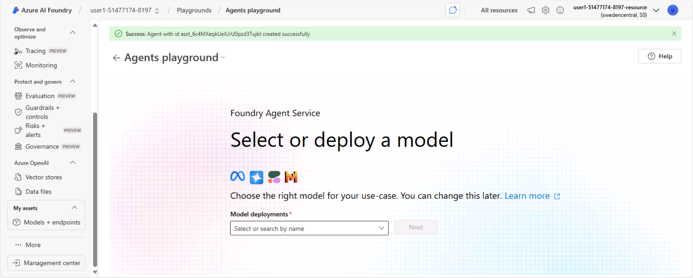

---
lab:
  title: Erkunden der KI-Agent-Entwicklung
  description: 'Führen Sie Ihre ersten Schritte bei der Entwicklung von KI-Agents durch, indem Sie den Azure AI Agent-Dienst im Azure AI Foundry-Portal erkunden.'
---

# Erkunden der KI-Agent-Entwicklung

In dieser Übung verwenden Sie den Azure AI Agent-Dienst im Azure AI Foundry-Portal, um einen einfachen KI-Agent zu erstellen, der Mitarbeitende bei Ausgabenabrechnungen unterstützt.

Diese Übung dauert ca. **30** Minuten.

> **Hinweis**: Einige der in dieser Übung verwendeten Technologien befinden sich in der Vorschau oder in der aktiven Entwicklung. Es kann zu unerwartetem Verhalten, Warnungen oder Fehlern kommen.

## Erstellen Sie ein Azure AI Foundry-Projekt und einen Agenten.

Beginnen wir mit dem Erstellen eines Azure AI Foundry-Projekts.

1. Öffnen Sie in einem Webbrowser unter `https://ai.azure.com` das [Azure KI Foundry-Portal](https://ai.azure.com) und melden Sie sich mit Ihren Azure-Anmeldeinformationen an. Schließen Sie alle Tipps oder Schnellstartfenster, die bei der ersten Anmeldung geöffnet werden, und verwenden Sie gegebenenfalls das Logo **Azure AI Foundry** oben links, um zur Startseite zu navigieren, die ähnlich wie die folgende Abbildung aussieht (schließen Sie das **Hilfe**-Fenster, falls es geöffnet ist):

    

1. Wählen Sie auf der Startseite **Agent erstellen**.
1. Geben Sie bei der Eingabeaufforderung zum Erstellen eines Projekts einen gültigen Namen für Ihr Projekt ein.
1. Erweitern Sie **Erweiterte Optionen** und nehmen Sie die folgenden Einstellungen vor:
    - **Azure KI Foundry-Ressource**: *Ein gültiger Name für Ihre Azure KI Foundry-Ressource*
    - **Abonnement:** *Geben Sie Ihr Azure-Abonnement an.*
    - **Ressourcengruppe**: *Wählen Sie Ihre Ressourcengruppe aus oder erstellen Sie eine neue*.
    - **Region**: *Wählen Sie einen beliebigen Standort aus, an dem KI Services unterstützt wird***\*

    > \* Einige Azure KI-Ressourcen unterliegen regionalen Modellkontingenten. Sollte im weiteren Verlauf der Übung eine Kontingentgrenze überschritten werden, müssen Sie möglicherweise eine weitere Ressource in einer anderen Region anlegen.

1. Klicken Sie auf **Erstellen**, und warten Sie, bis das Projekt erstellt wird.
1. Nach dem Erstellen Ihres Projekts wird automatisch der Agenten-Playground geöffnet, sodass Sie ein Modell auswählen oder bereitstellen können:

    

    >**Hinweis**: Bei der Erstellung Ihres Agenten und Ihres Projekts wird automatisch ein GPT-4o-Basismodell bereitgestellt.

Sie werden feststellen, dass ein Agent mit einem Standardnamen für Sie erstellt wurde, zusammen mit Ihrer Basis-Modellbereitstellung.

## Erstellen Ihres Agents

Nachdem Sie nun ein Modell bereitgestellt haben, können Sie einen KI-Agent erstellen. In dieser Übung erstellen Sie einen einfachen Agent, der Fragen auf der Grundlage einer Richtlinie für Unternehmensausgaben beantwortet. Sie laden das Dokument zur Ausgabenpolitik herunter und verwenden es als *Grundlagen* für den Agent.

1. Öffnen Sie eine weitere Browser-Registerkarte und laden Sie [Expenses_policy.docx](https://raw.githubusercontent.com/MicrosoftLearning/mslearn-ai-agents/main/Labfiles/01-agent-fundamentals/Expenses_Policy.docx) von `https://raw.githubusercontent.com/MicrosoftLearning/mslearn-ai-agents/main/Labfiles/01-agent-fundamentals/Expenses_Policy.docx` herunter und speichern Sie es lokal. Dieses Dokument enthält Details der Spesenrichtlinie für das fiktive Contoso-Unternehmen.
1. Kehren Sie zur Browser-Registerkarte mit dem Foundry Agents-Playground zurück und suchen Sie den Bereich **Setup** (dieser befindet sich möglicherweise seitlich oder unterhalb des Chatfensters).
1. Setzen Sie den **Agentennamen** auf `ExpensesAgent`, stellen Sie sicher, dass die zuvor erstellte gpt-4o-Modellbereitstellung ausgewählt ist, und setzen Sie die **Anweisungen** auf:

    ```prompt
   You are an AI assistant for corporate expenses.
   You answer questions about expenses based on the expenses policy data.
   If a user wants to submit an expense claim, you get their email address, a description of the claim, and the amount to be claimed and write the claim details to a text file that the user can download.
    ```

    

1. Weiter unten im Bereich **Einstellungen**, neben der Überschrift **Wissen**, wählen Sie **+ Hinzufügen**. Wählen Sie dann im Dialogfeld **Wissen hinzufügen** die Option **Dateien**.
1. Erstellen Sie im Dialogfeld **Dateien hinzufügen** einen neuen Vektorspeicher mit dem Namen `Expenses_Vector_Store`, indem Sie die zuvor heruntergeladene lokale Datei **Expenses_policy.docx** hochladen und speichern.
1. Überprüfen Sie im Bereich **Setup** im Abschnitt **Wissen**, dass **Expenses_Vector_Store** aufgelistet ist und als 1 Datei enthaltend angezeigt wird.
1. Wählen Sie unter dem Abschnitt **Wissen** neben **Aktionen** **+Hinzufügen** aus. Wählen Sie dann im Dialogfeld **Aktion hinzufügen** den **Code-Interpreter** und dann **Speichern** aus (Sie müssen keine Dateien für den Code-Interpreter hochladen).

    Ihr Agent verwendet das Dokument, das Sie als Wissensquelle hochgeladen haben, um seine Antworten zu *begründen* (mit anderen Worten, er beantwortet Fragen basierend auf dem Inhalt dieses Dokuments). Es wird das Code-Interpreter-Tool verwenden, um Aktionen auszuführen, indem er seinen eigenen Python-Code generiert und ausführt.

## Testen Sie Ihren Agent

Nachdem Sie einen Agenten erstellt haben, können Sie ihn im Chat des Playgrounds testen.

1. Geben Sie im Chat-Eintrag des Playgrounds die Eingabeaufforderung `What's the maximum I can claim for meals?` ein und überprüfen Sie die Antwort des Agenten, die auf den Informationen in der Spesenrichtlinie basieren sollte, die Sie als Wissen zur Agentenkonfiguration hinzugefügt haben.

    > **Hinweis**: Wenn der Agent nicht antwortet, weil das Ratenlimit überschritten ist. Warten Sie einige Sekunden, und versuchen Sie es noch mal. Wenn in Ihrem Abonnement nicht genügend Kontingent verfügbar ist, kann das Modell möglicherweise nicht reagieren. Wenn das Problem weiterhin besteht, versuchen Sie, die Quote für Ihr Modell auf der Seite **Modelle + Endgeräte** zu erhöhen.

1. Versuchen Sie die folgende Folgeäußerung `I'd like to submit a claim for a meal.` und überprüfen Sie die Antwort: Der Agent sollte Sie um die erforderlichen Informationen bitten, um einen Anspruch zu übermitteln.
1. Stellen Sie dem Agenten eine E-Mail-Adresse zur Verfügung; zum Beispiel: `fred@contoso.com`. Der Agent sollte die Antwort bestätigen und die verbleibenden Informationen anfordern, die für den Ausgabenanspruch erforderlich sind (Beschreibung und Betrag)
1. Übermitteln Sie eine Eingabeaufforderung, die den Anspruch und den Betrag beschreibt; zum Beispiel: `Breakfast cost me $20`.
1. Der Agent sollte den Code-Interpreter verwenden, um die Textdatei für die Spesenabrechnung vorzubereiten und einen Link bereitzustellen, damit Sie sie herunterladen können.

    

1. Laden Sie das Textdokument herunter, und öffnen Sie es, um die Ausgabenanspruchsdetails anzuzeigen.

## Bereinigen

Nachdem Sie die Übung beendet haben, sollten Sie die von Ihnen erstellten Cloud-Ressourcen löschen, um eine unnötige Ressourcennutzung zu vermeiden.

1. Öffnen Sie das [Azure-Portal](https://portal.azure.com) unter `https://portal.azure.com` und zeigen Sie den Inhalt der Ressourcengruppe an, in der Sie die in dieser Übung verwendeten Hub-Ressourcen bereitgestellt haben.
1. Wählen Sie auf der Symbolleiste die Option **Ressourcengruppe löschen** aus.
1. Geben Sie den Namen der Ressourcengruppe ein, und bestätigen Sie, dass Sie sie löschen möchten.
