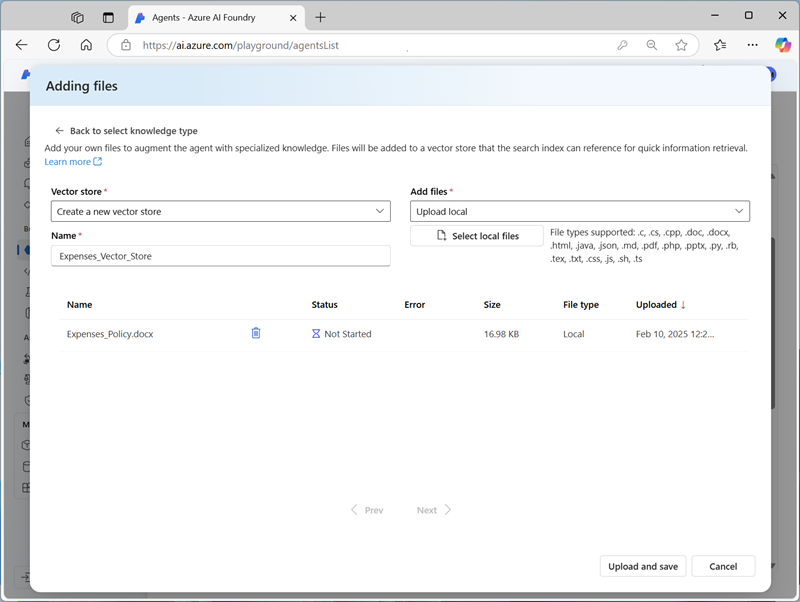
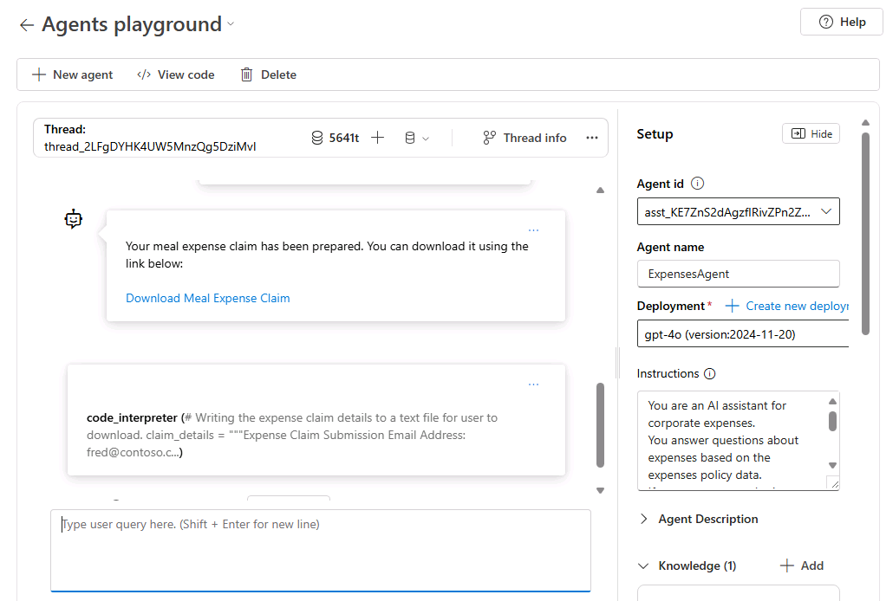

---
lab:
  title: Erkunden der KI-Agent-Entwicklung
  description: 'Führen Sie Ihre ersten Schritte bei der Entwicklung von KI-Agents durch, indem Sie die Azure AI Agent-Diensttools im Azure AI Foundry-Portal erkunden.'
---

# Erkunden der KI-Agent-Entwicklung

In dieser Übung verwenden Sie die Tools des Azure AI Agent-Dienstes im Azure AI Foundry-Portal, um einen einfachen KI-Agent zu erstellen, der Fragen zu Ausgabenabrechnungen beantwortet.

Diese Übung dauert ca. **30** Minuten.

> **Hinweis**: Einige der in dieser Übung verwendeten Technologien befinden sich in der Vorschau oder in der aktiven Entwicklung. Es kann zu unerwartetem Verhalten, Warnungen oder Fehlern kommen.

## Erstellen eines Azure KI Foundry-Projekts

Beginnen wir mit dem Erstellen eines Azure AI Foundry-Projekts.

1. Öffnen Sie in einem Webbrowser unter `https://ai.azure.com` das [Azure KI Foundry-Portal](https://ai.azure.com) und melden Sie sich mit Ihren Azure-Anmeldeinformationen an. Schließen Sie alle Tipps oder Schnellstartfenster, die bei der ersten Anmeldung geöffnet werden, und verwenden Sie gegebenenfalls das Logo **Azure AI Foundry** oben links, um zur Startseite zu navigieren, die ähnlich wie die folgende Abbildung aussieht (schließen Sie das **Hilfe**-Fenster, falls es geöffnet ist):

    

1. Wählen Sie auf der Startseite **+ Projekt erstellen**.
1. Geben Sie im Assistenten **Projekt erstellen** einen gültigen Namen für Ihr Projekt ein und wählen Sie, falls ein vorhandener Hub vorgeschlagen wird, die Option, einen neuen zu erstellen. Überprüfen Sie dann die Azure-Ressourcen, die automatisch erstellt werden, um Ihren Hub und Ihr Projekt zu unterstützen.
1. Wählen Sie **Anpassen** aus und legen Sie die folgenden Einstellungen für Ihren Hub fest:
    - **Hubname**: *Geben Sie einen gültigen Namen für Ihren Hub an*
    - **Abonnement:** *Geben Sie Ihr Azure-Abonnement an.*
    - **Ressourcengruppe**: *Erstellen Sie eine Ressourcengruppe, oder wählen Sie eine Ressourcengruppe aus*.
    - **Standort:** Wählen Sie eine der folgenden Regionen aus:\*
        - eastus
        - eastus2
        - swedencentral
        - westus
        - westus3
    - A**zure KI Services oder Azure OpenAI verbinden**: *Wählen Sie Neuen KI-Dienst erstellen aus*
    - **Azure KI-Suche verbinden**: Verbindung überspringen

    > \* Zum Zeitpunkt des Schreibens unterstützen diese Regionen das gpt-4o-Modell für die Nutzung in Agents. Die Modellverfügbarkeit wird durch regionale Kontingente eingeschränkt. Sollte im weiteren Verlauf der Übung eine Kontingentgrenze erreicht werden, besteht die Möglichkeit, dass Sie ein weiteres Projekt in einer anderen Region erstellen müssen.

1. Klicken Sie auf **Weiter**, um Ihre Konfiguration zu überprüfen. Klicken Sie auf **Erstellen** und warten Sie, bis der Vorgang abgeschlossen ist.
1. Sobald Ihr Projekt erstellt wurde, schließen Sie alle angezeigten Tipps und überprüfen Sie die Projektseite im Azure AI Foundry-Portal, die in etwa wie in der folgenden Abbildung aussehen sollte:

    

## Bereitstellen eines generativen KI-Modells

Jetzt können Sie ein generatives KI-Sprachmodell bereitstellen, um Ihren Agent zu unterstützen.

1. Wählen Sie im linken Fensterbereich für Ihr Projekt im Abschnitt **Meine Assets** die Seite **Modelle + Endpunkte**.
1. Wählen Sie auf der Seite **Modelle + Endpunkte** auf der Registerkarte **Modellbereitstellungen** im Menü **+ Modell bereitstellen** die Option **Basismodell bereitstellen**.
1. Suchen Sie das Modell **gpt-4o** in der Liste, wählen Sie es aus und bestätigen Sie es.
1. Stellen Sie das Modell mit den folgenden Einstellungen bereit, indem Sie **Anpassen** in den Bereitstellungsdetails wählen:
    - **Bereitstellungsname:***Ein eindeutiger Name für die Modellimplementierung*
    - **Bereitstellungstyp**: Globaler Standard
    - **Automatische Versionsaktualisierung**: Aktiviert
    - **Modellversion**: *Wählen Sie die neueste verfügbare Version aus.*
    - **Verbundene AI-Ressource**: *Wählen Sie Ihre Azure OpenAI-Ressourcenverbindung*
    - **Tokens pro Minute Ratenlimit (Tausende)**: 50K *(oder das in Ihrem Abonnement verfügbare Maximum, wenn weniger als 50K)*
    - **Inhaltsfilter**: StandardV2 

    > **Hinweis:** Durch das Verringern des TPM wird die Überlastung des Kontingents vermieden, das in dem von Ihnen verwendeten Abonnement verfügbar ist. 50.000 TPM sollten für die in dieser Übung verwendeten Daten ausreichend sein. Wenn Ihr verfügbares Kontingent darunter liegt, können Sie die Übung zwar abschließen, müssen aber möglicherweise warten und die Prompts erneut senden, wenn das Kontingent überschritten wird.

1. Warten Sie, bis die Bereitstellung abgeschlossen ist.

## Einen KI-Agent erstellen

Nachdem Sie nun ein Modell bereitgestellt haben, können Sie einen KI-Agent erstellen. In dieser Übung erstellen Sie einen einfachen Agent, der Fragen auf der Grundlage einer Richtlinie für Unternehmensausgaben beantwortet. Sie laden das Dokument zur Ausgabenpolitik herunter und verwenden es als *Grundlagen* für den Agent.

1. Öffnen Sie eine weitere Browser-Registerkarte und laden Sie [Expenses_policy.docx](https://raw.githubusercontent.com/MicrosoftLearning/mslearn-ai-agents/main/Labfiles/01-agent-fundamentals/Expenses_Policy.docx) von `https://raw.githubusercontent.com/MicrosoftLearning/mslearn-ai-agents/main/Labfiles/01-agent-fundamentals/Expenses_Policy.docx` herunter und speichern Sie es lokal. Dieses Dokument enthält Details der Spesenrichtlinie für das fiktive Contoso-Unternehmen.
1. Kehren Sie zur Browser-Registerkarte zurück, die das Azure AI Foundry-Portal enthält, und wählen Sie im Navigationsbereich auf der linken Seite im Abschnitt **Erstellen und Anpassen** die Seite **Agents**.
1. Wenn Sie dazu aufgefordert werden, wählen Sie Ihre Azure OpenAI-Dienstressource aus, und wechseln Sie dorthin.

    Ein neuer Agent mit einem Namen wie *Agent123* sollte automatisch erstellt werden (falls nicht, verwenden Sie die Schaltfläche **+ Neuer Agent**, um einen zu erstellen).

1. Wählen Sie Ihren neuen Agent. Setzen Sie dann im Bereich **Setup** für Ihren neuen Agenten den **Agentenname** auf `ExpensesAgent`, stellen Sie sicher, dass die zuvor erstellte gpt-4o-Modellbereitstellung ausgewählt ist, und setzen Sie die **Anweisungen** auf `Answer questions related to expense claims`.

    

1. Weiter unten im Bereich **Einstellungen**, neben der Überschrift **Wissen**, wählen Sie **+ Hinzufügen**. Wählen Sie dann im Dialogfeld **Wissen hinzufügen** die Option **Dateien**.
1. Erstellen Sie im Dialogfeld **Dateien hinzufügen** einen neuen Vektorspeicher mit dem Namen `Expenses_Vector_Store`, indem Sie die zuvor heruntergeladene lokale Datei **Expenses_policy.docx** hochladen und speichern.

    

1. Überprüfen Sie im Bereich **Setup** im Abschnitt **Wissen**, dass **Expenses_Vector_Store** aufgelistet ist und als 1 Datei enthaltend angezeigt wird.

    > **Hinweis**: Sie können auch **Aktionen** zu einem Agent hinzufügen, um Aufgaben zu automatisieren. In diesem einfachen Beispiel für einen Informationsbeschaffungs-Agent sind keine Aktionen erforderlich.

## Testen Sie Ihren Agent

Nachdem Sie nun einen Agent erstellt haben, können Sie ihn im Azure AI Foundry-Portal-Playground testen.

1. Wählen Sie oben im Bereich **Setup** für Ihren Agenten die Option **TRY im Playground **.
1. Geben Sie im Playground die Eingabeaufforderung `What's the maximum I can claim for meals?` ein und überprüfen Sie die Antwort des Agenten, die auf den Informationen in dem Dokument zur Ausgabenpolitik basieren sollte, das Sie als Wissen zur Einrichtung des Agents hinzugefügt haben.

    

    > **Hinweis**: Wenn der Agent nicht antwortet, weil das Ratenlimit überschritten ist. Warten Sie einige Sekunden, und versuchen Sie es noch mal. Wenn in Ihrem Abonnement nicht genügend Kontingent verfügbar ist, kann das Modell möglicherweise nicht reagieren.

1. Versuchen Sie es mit einer Folgefrage, z. B. `What about accommodation?`, und prüfen Sie die Antwort.

## Bereinigen

Nachdem Sie die Übung beendet haben, sollten Sie die von Ihnen erstellten Cloud-Ressourcen löschen, um eine unnötige Ressourcennutzung zu vermeiden.

1. Öffnen Sie das [Azure-Portal](https://portal.azure.com) unter `https://portal.azure.com` und zeigen Sie den Inhalt der Ressourcengruppe an, in der Sie die in dieser Übung verwendeten Hub-Ressourcen bereitgestellt haben.
1. Wählen Sie auf der Symbolleiste die Option **Ressourcengruppe löschen** aus.
1. Geben Sie den Namen der Ressourcengruppe ein, und bestätigen Sie, dass Sie sie löschen möchten.
